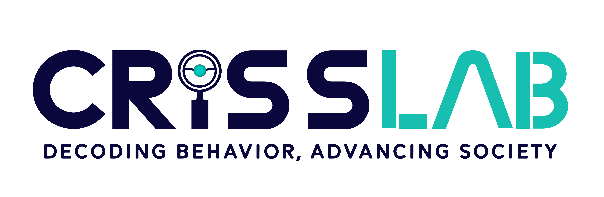

<section>
  

    
  

</section>

CRiSS-LAB estudia cómo las sociedades deciden qué importa. Desarrollamos aproximaciones computacionales a la relevancia colectiva: los procesos mediante los cuales personas, grupos e instituciones asignan atención, preservan memoria, organizan preferencias y coordinan decisiones.

Nuestro trabajo conecta ciencia social computacional, ciencia de redes, modelos dinámicos, inferencia causal, IA y plataformas experimentales para estudiar sistemas sociales en contextos de abundancia informativa. En educación, ciencia, cultura, política, organizaciones y plataformas digitales, generamos evidencia que ayuda a las instituciones a entender el comportamiento colectivo y tomar mejores decisiones.

El laboratorio conecta investigación rigurosa con plataformas aplicadas y herramientas de interés público. Proyectos como Lixandria, Discolab, PriorizaChile, SocialRec, MúsicaCL, DYNAMAP y Capybara traducen ciencia social computacional en evidencia útil para estudiantes, colegios, instituciones públicas, organizaciones, aplicaciones de negocio y debate cívico.

CRiSS-LAB reúne investigadores, estudiantes de postgrado, científicos de datos y colaboradores de física, ingeniería, educación, psicología, economía, sociología, ciencia política y computación. El laboratorio opera desde el Instituto de Data Science de la Facultad de Ingeniería de la Universidad del Desarrollo.

<em>Cristian Candia, Ph.D.</em> <em>Director del Computational Research in Social Science Lab.</em>

